# 🤖 Codezy — AI-Powered Code Solution & Mentorship Platform

<p align="center">

**Codezy** is a full-stack developer platform that combines **code solution management, social coding, AI-powered mentorship, semantic search, competitive-programming communities, and real-time collaboration** into a single developer ecosystem.

</p>

<p align="center">


<a href="https://services-ten-ashy.vercel.app/"></a>
</p>

---

# 📌 Table of Contents

- [Overview](#overview)
- [Problem Statement](#problem-statement)
- [Solution](#-solution)
- [Key Features](#-key-features)
  - [Solution Management](#-solution-management)
  - [Solution Discovery](#-solution-discovery)
  - [Social Coding](#social-coding)
  - [Bookmarks](#-bookmarks)
  - [Authentication](#-authentication)
  - [Developer Progress](#-developer-progress)
- [AI-Powered Mentorship](#-ai-powered-mentorship)
- [System Architecture](#️-system-architecture)
- [Major Workflows](#-major-workflows)
  - [Solution Management](#1-solution-management)
  - [AI Mentorship — RAG Pipeline](#2-ai-mentorship--rag-pipeline)
  - [Code Solution Ingestion](#3-code-solution-ingestion)
  - [Contest Notification & Group Auto-Generation](#4-contest-notification--group-auto-generation)
  - [Contest Group Lifecycle](#5-contest-group-lifecycle)
- [Real-Time Architecture](#-real-time-architecture)
- [Background Workers](#️-background-workers)
- [AI & RAG Architecture](#-ai--rag-architecture)
- [Frontend Architecture](#️-frontend-architecture)
- [Frontend State Management](#-frontend-state-management)
- [Database Design](#️-database-design)
- [Data Storage Strategy](#-data-storage-strategy)
- [Authentication & Security](#-authentication--security)
- [API Architecture](#-api-architecture)
- [Backend Architecture](#️-backend-architecture)
- [Project Structure](#-project-structure)
- [Performance & Scalability](#-performance--scalability)
- [Future Scalable Architecture](#-future-scalable-architecture)
- [Key Engineering Decisions](#-key-engineering-decisions)
- [Development Workflow](#-development-workflow)
- [Technology Stack](#technology-stack)
- [Project Highlights](#-project-highlights)
- [Engineering Concepts Demonstrated](#-engineering-concepts-demonstrated)
- [Screenshots](#-screenshots)
- [Installation](#️-installation)
- [Environment Variables](#-environment-variables)
- [Running the Application](#️-running-the-application)
- [Contributing](#-contributing)
- [License](#-license)
- [Author](#-author)
- [Support](#-support)
- [Final Architecture Summary](#-final-architecture-summary)

---


# Overview

Developers solve hundreds of programming problems across platforms such as LeetCode, Codeforces, CodeChef, HackerRank, and interview-preparation portals.

However, their solutions, explanations, notes, and learning progress often become scattered across:

* Local files
* GitHub repositories
* Coding platforms
* Browser bookmarks
* Personal notes
* Screenshots
* Messaging applications

**Codezy** solves this fragmentation by providing a centralized platform where developers can:

* Store and organize coding solutions
* Discover solutions using structured filters
* Share solutions with the developer community
* Like, comment, and bookmark solutions
* Track their coding activity
* Write and manage code inside a Monaco-based editor
* Ask an AI mentor questions about coding concepts
* Retrieve relevant solutions using RAG
* Discover upcoming coding contests
* Automatically generate contest-specific discussion groups
* Receive real-time contest notifications
* Preserve historical contest discussions and solutions

The platform is designed not merely as a CRUD application, but as an exploration of **production-oriented full-stack architecture, AI integration, event-driven systems, real-time communication, and scalable backend design**.

# Problem Statement

Competitive programmers and software developers generate a large amount of reusable knowledge while solving problems.

A developer might solve a problem on one platform, save an optimized version locally, write an explanation somewhere else, and later forget where the solution was stored.

This creates several engineering and learning problems.

### 1. Fragmented Knowledge

Solutions are distributed across multiple platforms and repositories.

### 2. Difficult Discovery

Finding an old solution based on:

* Problem name
* Difficulty
* Topic
* Programming language
* Coding platform
* Solution approach

becomes increasingly difficult as the number of solutions grows.

### 3. Limited Community Interaction

Traditional solution repositories generally focus on storing code rather than building a community around it.

Developers need a place where they can:

* Discuss approaches
* Comment on solutions
* Share alternative implementations
* Bookmark useful solutions

### 4. Repeated Problem Solving

Developers often encounter problems similar to ones that have already been solved by themselves or others.

Without semantic discovery, finding those solutions can require manually searching through large repositories.

### 5. No Context-Aware AI Assistance

A generic LLM can answer programming questions, but it does not automatically know the developer's existing solution repository.

Codezy addresses this using **Retrieval-Augmented Generation (RAG)**.

### 6. Contest Information Is Disconnected

Competitive programmers often need to manually check multiple platforms for upcoming contests.

Codezy automates contest discovery and connects contests with dedicated community groups.

---

# 💡 Solution

Codezy combines a traditional developer platform with modern AI and distributed-system concepts.

At a high level:

```text
                    ┌─────────────────────────┐
                    │         CODEZY          │
                    └────────────┬────────────┘
                                 │
          ┌──────────────────────┼──────────────────────┐
          │                      │                      │
          ▼                      ▼                      ▼
   Solution Platform       AI Mentorship         Contest Community
          │                      │                      │
          ▼                      ▼                      ▼
   CRUD + Search              RAG + LLM          Workers + WebSockets
          │                      │                      │
          └──────────────────────┼──────────────────────┘
                                 ▼
                         Developer Ecosystem
```

The core philosophy is:

> **Store → Organize → Discover → Learn → Discuss → Compete → Improve**

---

# ✨ Key Features

## 🧠 Solution Management

Users can create and manage programming solutions containing:

* Problem title
* Problem description
* Solution code
* Programming language
* Difficulty
* Topic
* Coding platform
* Explanation
* Author information

Supported operations include:

* Create
* Read
* Update
* Delete
* View
* Search
* Filter

---

## 🔍 Solution Discovery

Solutions can be discovered using structured metadata:

* Problem name
* Programming language
* Difficulty
* Topic
* Platform
* Author

Pagination is used to prevent large datasets from being returned in a single request.

---

## ❤️ Social Coding

Codezy adds community interaction around solutions.

Users can:

* Like solutions
* Comment on solutions
* View other developers' solutions
* Discuss approaches
* Share alternative solutions

---

## 🔖 Bookmarks

Developers can bookmark solutions for later reference.

Useful for:

* Interview preparation
* Important algorithms
* Frequently used patterns
* Interesting implementations
* Revision

---

## 👤 Authentication

Codezy provides:

* User registration
* Login
* JWT authentication
* Protected routes
* User profiles
* Authenticated actions

---

## 📊 Developer Progress

The platform can track:

* Number of solutions
* Problems solved
* Languages used
* Topics practiced
* User activity
* Community contributions

---

# 🤖 AI-Powered Mentorship

One of Codezy's major extensions is an AI mentorship system backed by **Retrieval-Augmented Generation (RAG)**.

Instead of relying exclusively on the LLM's pretrained knowledge, Codezy retrieves relevant solutions from its own knowledge base before generating an answer.

```text
User Question
      │
      ▼
Query Embedding
      │
      ▼
ChromaDB Semantic Search
      │
      ▼
Relevant Code Solutions
      │
      ▼
Context Construction
      │
      ▼
Prompt + Retrieved Context
      │
      ▼
LLM
      │
      ▼
AI Mentor Response
```

This allows the AI mentor to answer questions using the developer's existing solution knowledge base.

---

# 🏗️ System Architecture

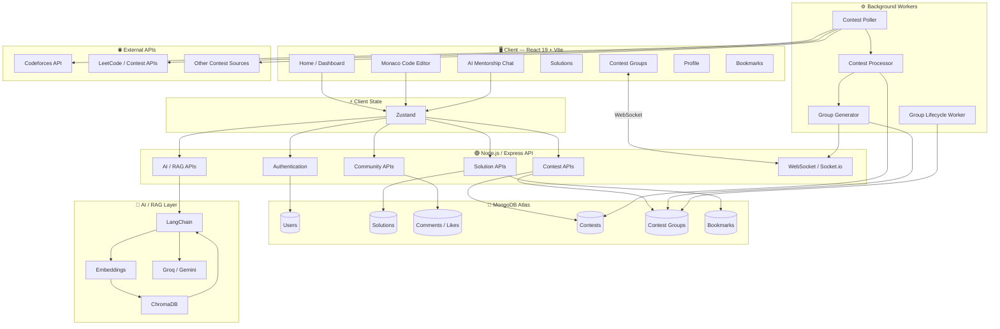

---

# 🔄 Major Workflows

## 1. Solution Management

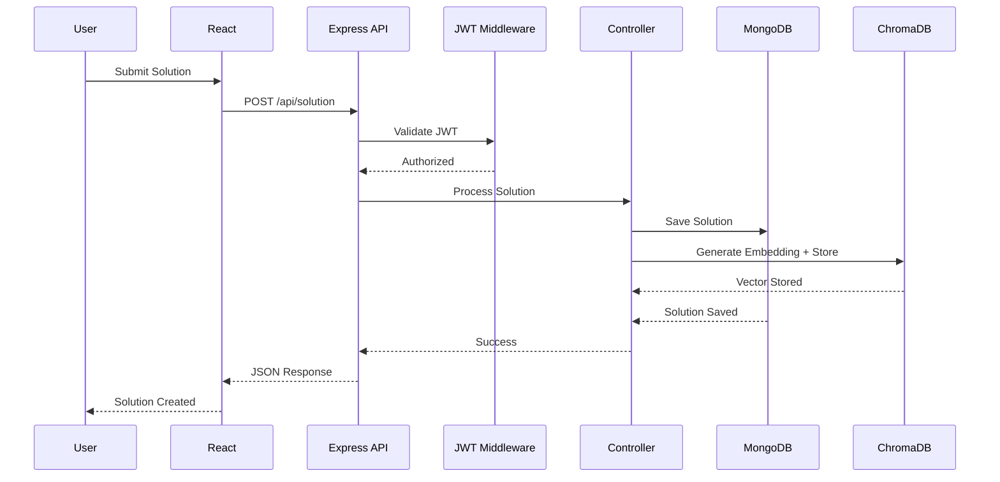

---

# 2. AI Mentorship — RAG Pipeline

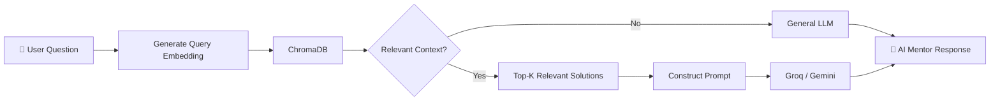

### Why RAG?

A conventional LLM has limitations:

```text
LLM
 │
 ├── General Knowledge
 ├── Training Data
 └── No Direct Access to Codezy Solutions
```

RAG adds an external knowledge layer:

```text
User Query
    ↓
Semantic Retrieval
    ↓
Codezy Knowledge Base
    ↓
Relevant Solutions
    ↓
LLM Context
    ↓
Answer
```

This allows the system to provide context-aware responses without retraining the model whenever a new solution is added.

---

# 3. Code Solution Ingestion

When a solution is submitted, Codezy maintains both:

1. A structured representation in MongoDB
2. A semantic representation in ChromaDB

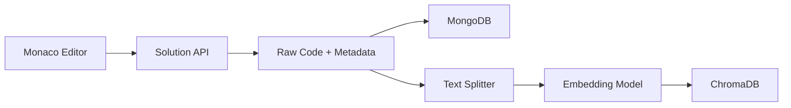

### Why two storage systems?

| Storage  | Purpose                     |
| -------- | --------------------------- |
| MongoDB  | Structured application data |
| ChromaDB | Semantic/vector retrieval   |

MongoDB is responsible for the application's source of truth.

ChromaDB is optimized for semantic retrieval.

---

# 4. Contest Notification & Group Auto-Generation

Codezy uses background processing to periodically fetch upcoming programming contests.

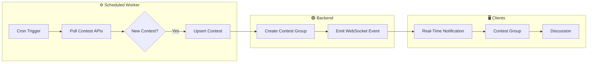

### Why use a background worker?

Contest fetching should not happen during every user request.

Bad architecture:

```text
User Request
     ↓
API Server
     ↓
Fetch External Contest API
     ↓
Wait
     ↓
Return Response
```

This creates unnecessary latency and couples user traffic to third-party APIs.

Instead:

```text
Background Worker
      ↓
External API
      ↓
MongoDB
      ↓
User API
```

The main API remains focused on serving user requests.

---

# 5. Contest Group Lifecycle

Every contest can have an associated discussion group.

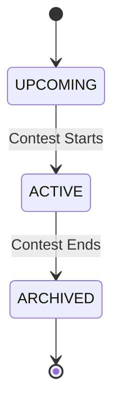

### Group Lifecycle

```text
Contest Detected
      ↓
Contest Stored
      ↓
Group Automatically Created
      ↓
Users Receive Notification
      ↓
Users Join Group
      ↓
Users Discuss Contest
      ↓
Users Share Solutions
      ↓
Contest Ends
      ↓
Group Archived
      ↓
Historical Discussion Preserved
```

The archived group can act as a historical knowledge base for future users.

---

# 🌐 Real-Time Architecture

Codezy uses WebSockets/Socket.io for real-time contest updates.

Instead of clients repeatedly asking:

```text
"Is there a new contest?"
"Is there a new contest?"
"Is there a new contest?"
```

the backend pushes an event when something changes.

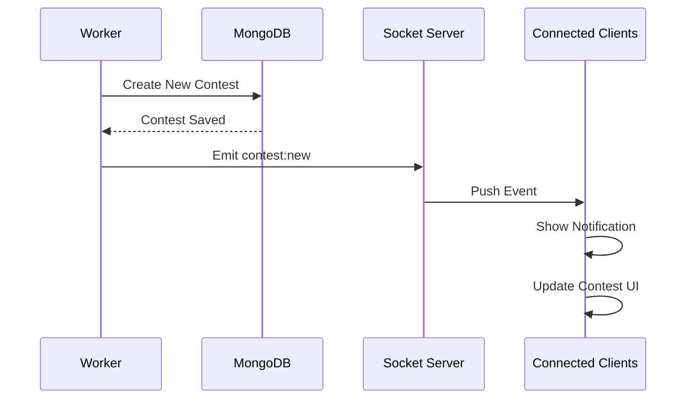

### Benefits

* Lower unnecessary polling
* Instant updates
* Better user experience
* Efficient event delivery
* Decoupled contest detection from frontend clients

---

# ⚙️ Background Workers

Background processing handles tasks that should not block normal API requests.

### Responsibilities

```text
workers/
│
├── contestFetcher
│      └── Fetch external contests
│
├── contestProcessor
│      └── Detect new/updated contests
│
├── groupGenerator
│      └── Create contest groups
│
└── groupLifecycle
       └── Archive completed contests
```

### Example Worker Flow

```text
Cron
 ↓
Fetch API
 ↓
Normalize Data
 ↓
Check Existing Contest
 ↓
Upsert MongoDB
 ↓
Detect New Contest
 ↓
Create Group
 ↓
Emit WebSocket Event
```

---

# 🧠 AI & RAG Architecture

## Components

### LangChain

Responsible for orchestrating the RAG pipeline.

Typical responsibilities:

* Document processing
* Text splitting
* Embedding integration
* Retriever configuration
* Prompt construction
* LLM orchestration

### ChromaDB

Acts as the vector store.

It stores embeddings representing coding solutions and allows semantic similarity search.

### Embeddings

A code solution is transformed into a vector representation:

```text
Solution
   ↓
Embedding Model
   ↓
[0.12, -0.42, 0.83, ...]
   ↓
Vector Database
```

A user query goes through the same process:

```text
User Question
     ↓
Embedding
     ↓
Query Vector
     ↓
Similarity Search
     ↓
Relevant Solutions
```

### LLM

The retrieved context is passed to an LLM such as the configured Groq/Gemini provider.

The LLM then generates the final response.

---

# 🧩 RAG Decision Flow

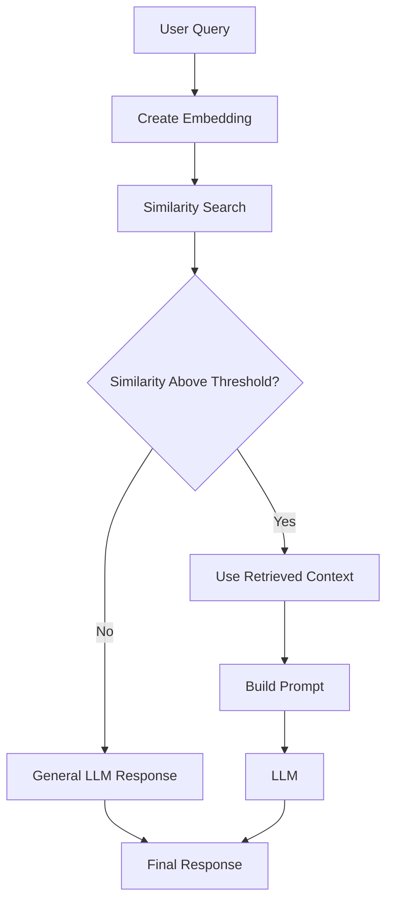

This gives Codezy two response modes:

### Retrieval-Augmented Response

```text
Query
 ↓
Relevant Codezy Solutions
 ↓
Context
 ↓
LLM
 ↓
Context-aware Answer
```

### General Response

```text
Query
 ↓
LLM
 ↓
General Answer
```

---

# 🖥️ Frontend Architecture

Codezy uses:

* React
* Vite
* Zustand
* Monaco Editor
* Tailwind CSS
* Framer Motion

The frontend is divided into reusable components and page-level modules.

```text
React Application
│
├── Pages
│   ├── Home
│   ├── Dashboard
│   ├── Login
│   ├── Register
│   ├── Profile
│   ├── Solutions
│   ├── Editor
│   ├── AI Chat
│   └── Contests
│
├── Components
│   ├── Navbar
│   ├── SolutionCard
│   ├── CommentSection
│   ├── Editor
│   ├── Chat
│   └── ContestGroup
│
├── Store
│   ├── User Store
│   ├── Editor Store
│   └── Application State
│
└── Services
    └── API Clients
```

---

# ⚡ Frontend State Management

Codezy uses **Zustand** for global client-side state.

Important state categories include:

```text
User State
    ↓
Authentication
Profile
Session

Editor State
    ↓
Code
Language
Problem
Execution State

Application State
    ↓
Solutions
Chat
Contest
Groups
```

Zustand keeps state management lightweight while avoiding excessive boilerplate.

---

# 🗄️ Database Design

Codezy uses MongoDB as its primary application database.

The original platform models users, solutions, comments, bookmarks, and likes, while the extended architecture adds contests and contest groups.

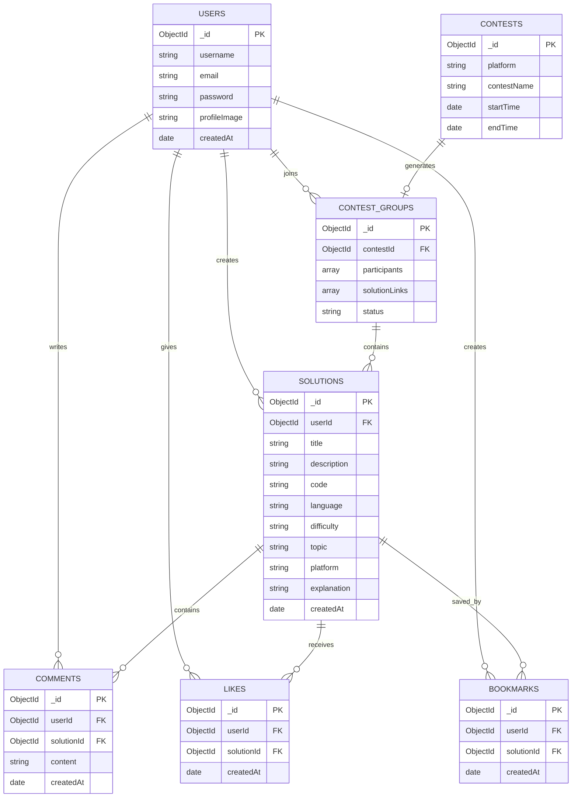

---

# 📐 Data Storage Strategy

Codezy intentionally separates:

### Application Database

```text
MongoDB
 │
 ├── Users
 ├── Solutions
 ├── Comments
 ├── Likes
 ├── Bookmarks
 ├── Contests
 └── Contest Groups
```

### Vector Database

```text
ChromaDB
 │
 ├── Solution Embeddings
 ├── Metadata
 └── Semantic Search Index
```

This separation allows each database to perform the task it is optimized for.

---

# 🔐 Authentication & Security

Codezy uses JWT-based authentication.

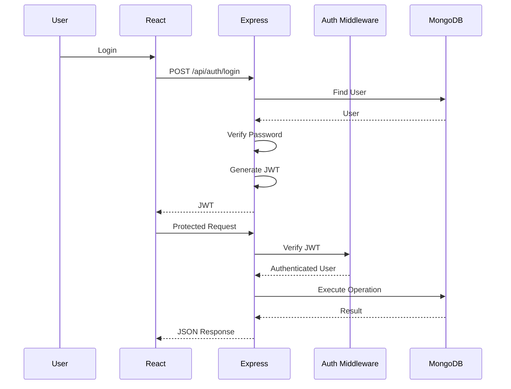

Security considerations include:

* Password hashing
* JWT authentication
* Protected routes
* Authentication middleware
* Input validation
* Environment variables
* Database validation
* Authorization checks

Secrets should never be committed to the repository.

---

# 🌐 API Architecture

The backend follows REST principles.

## Main API Modules

```text
/api/auth
/api/user
/api/solution
/api/ai
/api/contest
/api/comments
/api/bookmarks
```

## Example Endpoints

| Method | Endpoint                      | Purpose           |
| ------ | ----------------------------- | ----------------- |
| POST   | `/api/auth/register`          | Register user     |
| POST   | `/api/auth/login`             | Login             |
| GET    | `/api/solutions`              | Fetch solutions   |
| POST   | `/api/solutions`              | Create solution   |
| GET    | `/api/solutions/:id`          | Get solution      |
| PUT    | `/api/solutions/:id`          | Update solution   |
| DELETE | `/api/solutions/:id`          | Delete solution   |
| POST   | `/api/solutions/:id/like`     | Like solution     |
| POST   | `/api/solutions/:id/bookmark` | Bookmark solution |
| POST   | `/api/solutions/:id/comments` | Add comment       |
| POST   | `/api/ai/chat`                | AI mentorship     |
| GET    | `/api/contests`               | Fetch contests    |
| GET    | `/api/contest/:id/group`      | Get contest group |

---

# 🏛️ Backend Architecture

The backend follows a modular architecture:

```text
Request
   ↓
Route
   ↓
Middleware
   ↓
Controller
   ↓
Service / Business Logic
   ↓
Model / External Service
   ↓
Database
   ↓
Response
```

Recommended separation:

```text
backend/
│
├── controllers/
├── routes/
├── models/
├── middlewares/
├── services/
├── ai/
├── rag/
├── workers/
├── sockets/
├── config/
└── index.js
```

This keeps routing, business logic, persistence, AI orchestration, and background processing separated.

---

# 📂 Project Structure

```text
Codezy/
│
├── frontend/
│   ├── src/
│   │   ├── components/
│   │   │   ├── Navbar/
│   │   │   ├── SolutionCard/
│   │   │   ├── Comments/
│   │   │   ├── Editor/
│   │   │   ├── Chat/
│   │   │   └── ContestGroup/
│   │   │
│   │   ├── pages/
│   │   │   ├── Home/
│   │   │   ├── Dashboard/
│   │   │   ├── Login/
│   │   │   ├── Register/
│   │   │   ├── Profile/
│   │   │   ├── Solutions/
│   │   │   ├── Editor/
│   │   │   ├── AIChat/
│   │   │   └── Contests/
│   │   │
│   │   ├── store/
│   │   │   ├── userStore.js
│   │   │   └── editorStore.js
│   │   │
│   │   ├── services/
│   │   └── App.jsx
│   │
│   └── package.json
│
├── backend/
│   │
│   ├── controllers/
│   │   ├── authController.js
│   │   ├── solutionController.js
│   │   ├── commentController.js
│   │   ├── bookmarkController.js
│   │   ├── contestController.js
│   │   └── aiController.js
│   │
│   ├── models/
│   │   ├── User.js
│   │   ├── Solution.js
│   │   ├── Comment.js
│   │   ├── Bookmark.js
│   │   ├── Contest.js
│   │   └── ContestGroup.js
│   │
│   ├── routes/
│   │   ├── authRoutes.js
│   │   ├── solutionRoutes.js
│   │   ├── commentRoutes.js
│   │   ├── contestRoutes.js
│   │   └── aiRoutes.js
│   │
│   ├── middlewares/
│   │   ├── authMiddleware.js
│   │   └── errorMiddleware.js
│   │
│   ├── ai/
│   │   ├── llm.js
│   │   ├── prompts.js
│   │   └── mentor.js
│   │
│   ├── rag/
│   │   ├── embeddings.js
│   │   ├── retriever.js
│   │   ├── vectorStore.js
│   │   └── pipeline.js
│   │
│   ├── workers/
│   │   ├── contestFetcher.js
│   │   ├── contestProcessor.js
│   │   ├── groupGenerator.js
│   │   └── groupLifecycle.js
│   │
│   ├── sockets/
│   │   └── socket.js
│   │
│   ├── config/
│   │   └── database.js
│   │
│   ├── index.js
│   └── package.json
│
└── README.md
```

---

# ⚡ Performance & Scalability

Codezy considers scalability at multiple layers.

## 1. Pagination

Instead of returning thousands of solutions:

```text
GET /api/solutions?page=2&limit=20
```

Only the required subset is returned.

Benefits:

* Lower network usage
* Faster responses
* Reduced database load
* Better frontend performance

---

## 2. Database Indexing

Frequently queried fields can be indexed:

```text
title
language
difficulty
topic
platform
userId
createdAt
```

This reduces unnecessary collection scans.

---

## 3. Stateless API

Authentication is token-based, allowing multiple backend instances to serve requests.

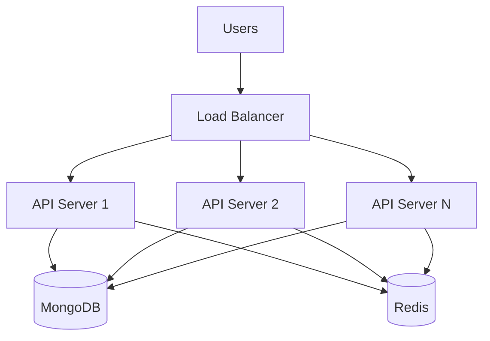

---

# ⚡ Future Scalable Architecture

For larger traffic:

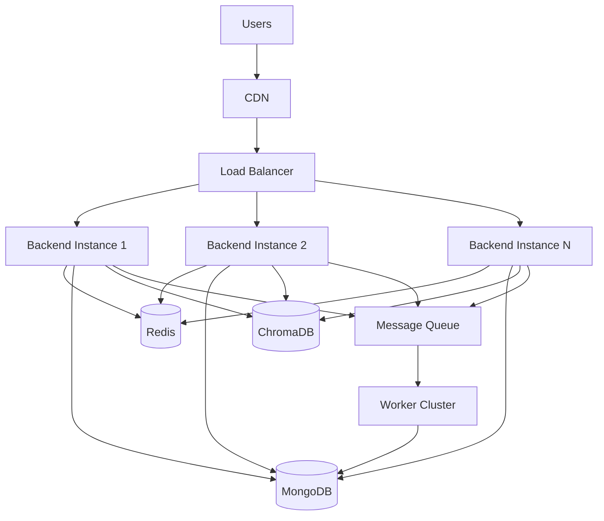

Possible infrastructure additions:

* Redis
* Message queues
* Load balancers
* CDN
* Horizontal scaling
* Docker
* Object storage
* Monitoring
* Centralized logging

---

# 🧠 Key Engineering Decisions

## Why MongoDB?

Codezy contains flexible document-oriented data such as coding solutions, metadata, explanations, contest information, and social interactions.

MongoDB provides:

* Flexible schemas
* Natural JSON integration with Node.js
* Document-oriented storage
* Indexing
* Easy schema evolution
* Horizontal scaling options

---

## Why ChromaDB?

MongoDB handles structured application data, while ChromaDB provides semantic vector search.

```text
MongoDB
   ↓
"What is this solution?"
"What user created it?"
"What language?"
"When was it created?"

ChromaDB
   ↓
"Which solutions are semantically similar?"
```

---

## Why RAG Instead of Fine-Tuning?

Fine-tuning modifies model behavior using training data, while RAG allows the application to dynamically retrieve external knowledge.

For Codezy:

```text
New Solution Added
       ↓
Generate Embedding
       ↓
Store in ChromaDB
       ↓
Immediately Available for Retrieval
```

No model retraining is required whenever a new solution is added.

---

## Why WebSockets?

Contest notifications are event-driven.

Polling:

```text
Client → Server
"Anything new?"

Client → Server
"Anything new?"

Client → Server
"Anything new?"
```

WebSockets:

```text
Server
   │
   │ Event
   ▼
Connected Clients
```

This provides a more efficient real-time communication model.

---

## Why Background Workers?

External contest APIs should not be queried synchronously during user requests.

Workers isolate:

* External API latency
* Polling
* Data processing
* Contest lifecycle management

from the main API request path.

---

# 🧪 Development Workflow

A typical feature follows:

```mermaid
flowchart LR

    A["Feature Requirement"]

    B["React Component"]

    C["Zustand State"]

    D["REST API"]

    E["Express Route"]

    F["Middleware"]

    G["Controller"]

    H["Service"]

    I["MongoDB / Vector DB"]

    J["JSON Response"]

    K["UI Update"]

    A --> B
    B --> C
    C --> D
    D --> E
    E --> F
    F --> G
    G --> H
    H --> I
    I --> J
    J --> K
```

For AI features:

```text
User Interaction
      ↓
Frontend
      ↓
AI API
      ↓
RAG Pipeline
      ↓
Embedding
      ↓
Vector Search
      ↓
Context
      ↓
LLM
      ↓
Response
      ↓
Frontend
```

---

# 🛠️ Technology Stack

| Category         | Technology                |
| ---------------- | ------------------------- |
| Frontend         | React 19                  |
| Build Tool       | Vite                      |
| State Management | Zustand                   |
| Code Editor      | Monaco Editor             |
| Styling          | Tailwind CSS              |
| Animation        | Framer Motion             |
| Backend          | Node.js                   |
| API Framework    | Express.js                |
| Database         | MongoDB Atlas             |
| ODM              | Mongoose                  |
| Authentication   | JWT                       |
| Real-Time        | Socket.io / WebSockets    |
| AI Orchestration | LangChain                 |
| Vector Database  | ChromaDB                  |
| LLM              | Groq / Gemini             |
| Background Jobs  | Node-Cron / Workers       |
| External APIs    | Codeforces / Contest APIs |
| Architecture     | REST + Event-Driven       |
| Version Control  | Git / GitHub              |

---

# 📊 Project Highlights

| Area                  | Implementation             |
| --------------------- | -------------------------- |
| Full Stack            | React + Node.js + Express  |
| Database              | MongoDB Atlas              |
| ODM                   | Mongoose                   |
| Authentication        | JWT                        |
| API                   | REST                       |
| State Management      | Zustand                    |
| Code Editor           | Monaco Editor              |
| AI                    | LLM Integration            |
| RAG                   | LangChain + ChromaDB       |
| Vector Search         | Semantic Similarity        |
| Social Features       | Likes + Comments           |
| Personalization       | Bookmarks                  |
| Contest System        | Automated Contest Fetching |
| Background Processing | Cron / Workers             |
| Real-Time             | WebSockets / Socket.io     |
| Community             | Contest Groups             |
| Scalability           | Pagination + Indexing      |
| Architecture          | Modular + Event-Driven     |

---

# ⚙️ Installation

## 1. Clone Repository

```bash
git clone https://github.com/your-username/Codezy.git

cd Codezy
```

---

## 2. Install Frontend

```bash
cd frontend

npm install
```

---

## 3. Install Backend

```bash
cd ../backend

npm install
```

---

# 🔑 Environment Variables

Create a `.env` file inside `backend/`.

```env
PORT=5000

MONGO_URI=your_mongodb_connection_string

JWT_SECRET=your_jwt_secret

GROQ_API_KEY=your_groq_api_key

GEMINI_API_KEY=your_gemini_api_key

CHROMA_URL=your_chroma_url

CLIENT_URL=http://localhost:5173
```

> Never commit `.env` files or API keys to GitHub.

Add:

```gitignore
.env
node_modules/
```

---

# ▶️ Running the Application

## Start Backend

```bash
cd backend

npm start
```

Backend:

```text
http://localhost:5000
```

---

## Start Frontend

Open another terminal:

```bash
cd frontend

npm run dev
```

Vite will provide the frontend development URL.

---

# 🔄 End-to-End Platform Flow

The complete Codezy ecosystem can be represented as:

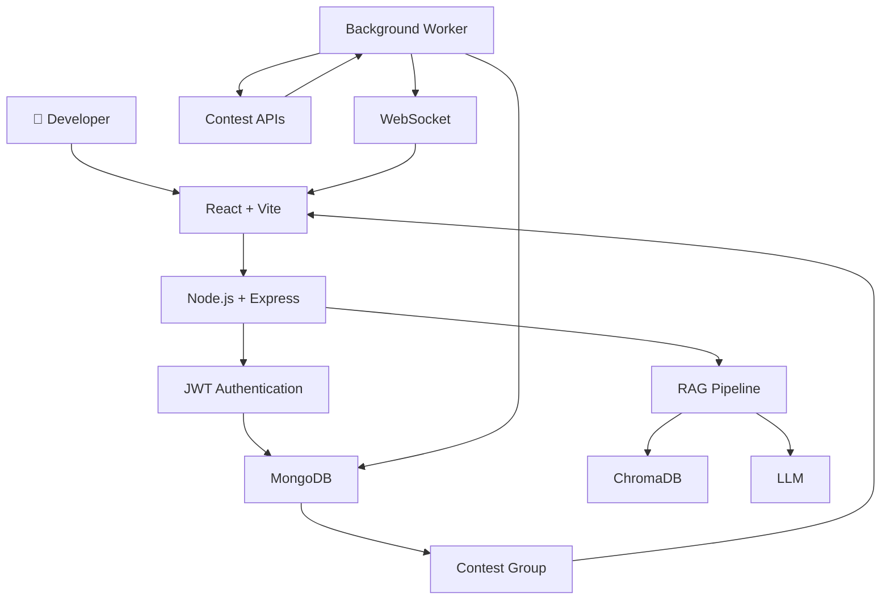

---

# 🔮 Future Improvements

## 💻 Online Code Execution

Integrate a secure sandboxed execution environment allowing developers to:

* Execute code
* Run test cases
* View output
* Debug programs
* Measure execution time
* Analyze memory usage

---

## 🤖 Advanced AI Mentor

Expand the AI mentor to support:

* Code explanation
* Bug detection
* Complexity analysis
* Optimization suggestions
* Test-case generation
* Alternative approaches
* Personalized learning paths
* Hint-based problem solving

---

## 🏆 Leaderboards

Introduce rankings based on:

* Problems solved
* Community contributions
* Likes received
* Contest participation
* Solution quality
* Community activity

---

## 👥 Developer Following

```text
Follow Developer
       ↓
Developer Activity
       ↓
New Solutions
       ↓
Community Discovery
```

---

## 🔔 Notification System

Support real-time notifications for:

* Likes
* Comments
* Mentions
* Contest announcements
* Group activity
* New followers

---

## ⚡ Redis

Redis can be introduced for:

* Frequently requested solutions
* User sessions
* Rate limiting
* Contest caching
* Distributed locks
* WebSocket scaling

Example:

```text
GET /api/solutions
       │
       ▼
    Redis
    /   \
  HIT   MISS
  │      │
  ▼      ▼
Return  MongoDB
          │
          ▼
        Redis
          │
          ▼
        Return
```

---

## 📨 Message Queue

For larger deployments:

```text
API
 │
 ▼
Message Queue
 │
 ├── Email Worker
 ├── Notification Worker
 ├── Embedding Worker
 ├── Contest Worker
 └── Analytics Worker
```

This prevents expensive asynchronous tasks from blocking API requests.

---

# 🧠 Engineering Concepts Demonstrated

Codezy demonstrates practical knowledge across multiple areas.

### Frontend

* React architecture
* Componentization
* Zustand state management
* Client-side routing
* Monaco Editor integration
* API integration
* Responsive UI
* Animations

### Backend

* Node.js
* Express.js
* REST API design
* MVC architecture
* Middleware
* JWT authentication
* Authorization
* Validation
* Error handling

### Database

* MongoDB
* Mongoose
* Schema design
* References
* Indexing
* Pagination
* Query optimization

### AI

* LLM integration
* Embeddings
* Vector databases
* Semantic search
* RAG
* Prompt construction
* Context retrieval
* LangChain

### Distributed Systems

* Background workers
* Event-driven architecture
* WebSockets
* External API polling
* Horizontal scaling
* Caching
* Message queues
* Stateless services

---

# 📸 Screenshots

Add screenshots of the major application views.

### 🏠 Home / Dashboard

```text
Add screenshot here
```

### 💻 Monaco Code Editor

```text
Add screenshot here
```

### 🤖 AI Mentor

```text
Add screenshot here
```

### 🏆 Contest Dashboard

```text
Add screenshot here
```

### 👥 Contest Discussion Group

```text
Add screenshot here
```

### 👤 Developer Profile

```text
Add screenshot here
```

---

# 🤝 Contributing

Contributions are welcome.

### 1. Fork the repository

```bash
git fork https://github.com/your-username/Codezy.git
```

### 2. Create a feature branch

```bash
git checkout -b feature/your-feature
```

### 3. Commit changes

```bash
git commit -m "Add your feature"
```

### 4. Push changes

```bash
git push origin feature/your-feature
```

### 5. Open a Pull Request

Describe:

* What was changed
* Why it was changed
* How it was implemented
* Any relevant screenshots or testing details

---

# 📄 License

This project is licensed under the **MIT License**.

---

# 👨‍💻 Author

## Sanchit Virdi

**Computer Science & Engineering**

**NIT Srinagar**

Codezy was developed as an intensive full-stack and system-design project exploring:

> **Modern Web Development + Backend Architecture + AI/RAG + Real-Time Systems + Event-Driven Design**

---

# ⭐ Support

If you find **Codezy** useful, consider giving the repository a ⭐.

```text
        ┌─────────────────────────────┐
        │           CODEZY            │
        ├─────────────────────────────┤
        │                             │
        │  Code                       │
        │   ↓                         │
        │  Community                  │
        │   ↓                         │
        │  Knowledge                  │
        │   ↓                         │
        │  AI Mentorship              │
        │   ↓                         │
        │  Better Problem Solving    │
        │                             │
        └─────────────────────────────┘

        Built for developers,
        powered by code and AI. 🤖
```

---

## 🏁 Final Architecture Summary

```text
                           CODEZY
                             │
             ┌───────────────┼────────────────┐
             │               │                │
             ▼               ▼                ▼
       SOLUTION HUB      AI MENTOR       CONTEST HUB
             │               │                │
             │               ▼                ▼
             │             RAG             WORKERS
             │               │                │
             ▼               ▼                ▼
          MongoDB        ChromaDB        Contest APIs
             │               │                │
             │               ▼                │
             │              LLM               │
             │               │                │
             └───────────────┼────────────────┘
                             ▼
                       DEVELOPER COMMUNITY
                             │
              ┌──────────────┼──────────────┐
              ▼              ▼              ▼
           DISCOVER        LEARN         DISCUSS
              │              │              │
              └──────────────┼──────────────┘
                             ▼
                         IMPROVE 🚀
```

> **Codezy is more than a coding repository — it is an AI-assisted developer knowledge and community platform built around scalable backend architecture, semantic retrieval, real-time communication, and automated event-driven workflows.**
